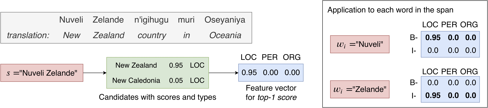

#  Soft Gazetteers for Low-resource Named Entity Recognition

This repository contains the code for experiments in the paper "[Soft Gazetteers for Low-Resource Named Entity Recognition](https://www.aclweb.org/anthology/2020.acl-main.722/)".

Traditional named entity recognition models use gazetteers (lists of entities) as features to improve performance. Designing such features for low-resource languages is challenging, because exhaustive entity gazetteers do not exist in these languages. To address this problem, we propose a method of “soft gazetteers” that incorporates ubiquitously available information from English knowledge bases, such as Wikipedia, into neural named entity recognition models through cross-lingual entity linking.

The paper contains experiments and analysis on four low-resource languages: Kinyarwanda (example sentence below), Oromo, Sinhala, and Tigrinya.

<div align="center"></div>

## Creating soft gazetteer features
The following process expects input in the CoNLL format: each line contains a word and its label for the NER task (space-separated), with a empty line between sentences. An example in English:
```
Hello O
, O
Bob B-PER
. O

I O
am O
Alice B-PER
. O
```

The example is in IOB2 format, but any other tagging scheme will work with the code.

We retrieve candidates through an entity linking system and store the created features prior to training the NER model, which reduces the computational overhead at training time. Features for the train, development, and test sets are to be created in the same way.

Consider a file, `train.conll`. 

1. **Extract spans** up to length *n* from the conll file.
`python data/get_ngrams.py --n 3 --filenames test.conll --output ngrams_list`

2. **Retrieve candidates** for all spans with an entity linking system.
In the paper, we use three methods for candidate retrieval. The knowledge base (KB) we use is extracted from Wikipedia: `data/english_knowledge-base.zip`.
	
	- Exact match --- String lookup of the span in gazetteers created from Wikipedia. This method will retrieve one candidate if it exactly matches the span and no candidates otherwise. The gazetteers, with respective KB ids, are in `data/gazetteers`.
	- WikiMention --- Instructions to obtain candidates are here: https://github.com/shyamupa/wiki_candgen.
	- Pivot-based-entity-linking --- Instructions to obtain candidates are here: https://github.com/shuyanzhou/pbel_plus.
	
	Any other entity linking method can be used. The output should be in the following format for the next steps:
    ```
    span_1 ||| cand_1_1 | score_1_1 || cand_1_2 | score_1_2 || ... 
    span_2 ||| cand_2_1 | score_2_1 || cand_2_2 | score_2_2 || ...
    ...
    ```
	
3. **Create soft gazetteer features** for each sentence in the NER dataset.
```
python code/create_softgaz_features.py  \
--candidates candidates_file  \
 --kb data/en_kb  \
 --normalize  \
 --feats all  \
 --conll_file train.conll
```
4. **Train the NER model** with the soft gazetteer features.

<div align="center"></div>

```
python code/bilstm_crf_softgazetteers.py  \
--train train.conll  \
--dev dev.conll  \
--test test.conll  \
--train_feats train.conll.softgazfeats.npz  \
--dev_feats dev.conll.softgazfeats.npz  \
--test_feats test.conll.softgazfeats.npz  \
--autoencoder --crf_feats --lstm_feats  \
--output_name ner_model  \
--dynet-autobatching 1
```
`--dynet-gpu` can be used if a GPU  is available for training.

To list all options: `python code/bilstm_crf_softgazetteers.py --help`.

## Downloading the data
The datasets used in this paper can be downloaded from LDC (https://www.ldc.upenn.edu/).

The catalog numbers are:
- Kinyarwanda: LDC2018E69
- Oromo: LDC2017E58
- Sinhala: LDC2018E70
- Tigrinya: LDC2017E57

## Citation
Please cite our paper if this repository was useful.
```
@inproceedings{rijhwani-etal-2020-soft,
    title = "Soft Gazetteers for Low-Resource Named Entity Recognition",
    author = "Rijhwani, Shruti  and
      Zhou, Shuyan  and
      Neubig, Graham  and
      Carbonell, Jaime",
    booktitle = "Proceedings of the 58th Annual Meeting of the Association for Computational Linguistics",
    month = jul,
    year = "2020",
    address = "Online",
    publisher = "Association for Computational Linguistics",
    url = "https://www.aclweb.org/anthology/2020.acl-main.722",
    pages = "8118--8123",
}
```
